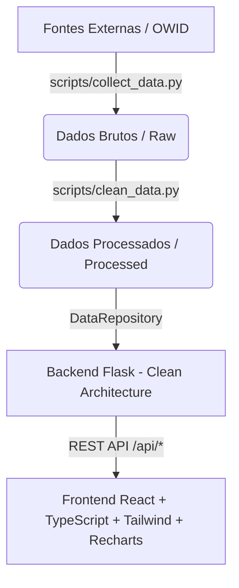

# Breathe Time 

[](https://github.com/4ndersonn/breathe-time/actions/workflows/ci.yml)
[](https://www.python.org/)
[](https://react.dev/)
[](https://flask.palletsprojects.com/)
[](https://tailwindcss.com/)
[](https://opensource.org/licenses/MIT)

Plataforma moderna de análise e visualização de dados sobre saúde mental, bem-estar, dinâmica social e tempo, baseada em evidências estatísticas globais e locais (Our World in Data). Desenvolvida sob padrões de **Clean Architecture**, **Engenharia de Dados** e **Desenvolvimento Full-Stack** com React, TypeScript, Flask e Tailwind CSS.

---

## Arquitetura do Sistema



---

## Módulos e Funcionalidades da Aplicação

### Frontend (React + Vite + TypeScript + Tailwind)
- **Início (`Home`)**: Dashboard central com indicadores-chave, navegação rápida e introdução à plataforma.
- **Domicílios Unipessoais (`Domicilios`)**: Análise demográfica da evolução de residências e domicílios unipessoais ao longo do tempo.
- **Suporte Social (`SuporteSocial`)**: Visualização de índices globais de suporte e redes de apoio comunitário e familiar.
- **Tempo Sozinho (`TempoSozinho`)**: Investigação estatística do tempo despendido em solidão por faixa etária e gênero.
- **TimeEngine (`Motor do tempo`)**: Módulo de simulação e navegação temporal analítica avançada.
- **Experiência Visual & Temas**: Suporte a Dark/Light mode com transições fluidas via Framer Motion e componentes customizados.

### Backend (Python + Flask)
- **Arquitetura Limpa (Clean Architecture)**:
  - `domain/`: Modelos de entidades de domínio.
  - `use_cases/`: Lógica de negócios (`DataService`).
  - `infrastructure/`: Repositórios de acesso a dados (`DataRepository`).
  - `api/`: Controladores, rotas e blueprints Flask (`/api/domicilios`, `/api/suporte-social`, `/api/tempo-sozinho`).
- **Engenharia de Dados**: Scripts automatizados de coleta (`collect_data.py`) e limpeza/padronização (`clean_data.py`) de dados estatísticos (Our World in Data).
- **Testes Automatizados**: Suíte completa de testes unitários e de integração utilizando `pytest`.

---

## Estrutura de Pastas

```text
breathe_time/
├── .github/workflows/                           ← Pipeline de CI/CD (GitHub Actions)
├── backend/                                     ← Servidor, API e pipeline de dados (Python - Clean Architecture)
│   ├── app/                                     ← Código principal do backend
│   │   ├── domain/                              ← Entidades e modelos de domínio
│   │   ├── use_cases/                           ← Casos de uso e regras de negócio (`data_service.py`)
│   │   ├── infrastructure/                      ← Repositórios de dados e persistência (`repositories.py`)
│   │   ├── api/                                 ← Rotas, controladores e endpoints da API Flask (`routes.py`)
│   │   └── data/                                ← Armazenamento de dados
│   │       ├── raw/                             ← Dados brutos originais
│   │       └── processed/                       ← Dados limpos e processados
│   ├── tests/                                   ← Testes automatizados do backend (`pytest`)
│   ├── requirements.txt                         ← Dependências de produção
│   └── requirements-dev.txt                     ← Dependências de desenvolvimento e testes
├── frontend/                                    ← Interface web moderna (React + Vite + TypeScript + Tailwind)
│   ├── src/                                     ← Código fonte da aplicação web
│   │   ├── components/                          ← Componentes reutilizáveis (UI, Navbar, Footer, etc.)
│   │   ├── pages/                               ← Páginas da aplicação (Home, Domicilios, TempoSozinho, SuporteSocial, TimeEngine)
│   │   ├── services/                            ← Comunicação com a API (`api.ts`)
│   │   └── theme/                               ← Contexto de temas (Dark/Light)
│   ├── package.json                             ← Dependências Node.js do frontend
│   └── vite.config.ts                           ← Configuração do Vite
├── docs/                                        ← Documentação complementar do projeto (`fontes.md`)
├── scripts/                                     ← Scripts de automação de pipeline
│   ├── setup.sh                                 ← Script de inicialização de ambiente
│   ├── collect_data.py                          ← Script de coleta de dados brutos
│   └── clean_data.py                            ← Script de limpeza e processamento
├── run.py                                       ← Entrypoint principal da API Flask
├── pyproject.toml                               ← Configuração de ferramentas (pytest, ruff, mypy)
└── README.md                                    ← Documentação principal do projeto
```

---

## Instalação e Execução

### 1. Pré-requisitos
- Python 3.10+
- Node.js 18+ & npm

### 2. Pipeline de Dados (Opcional - Dados já inclusos)
Caso queira baixar e reprocessar os dados brutos do Our World in Data:
```bash
python scripts/collect_data.py
python scripts/clean_data.py
```

### 3. Backend (Python / Flask)
1. Instale as dependências de desenvolvimento e testes:
   ```bash
   pip install -r backend/requirements-dev.txt
   ```
2. Inicie a API Flask (`http://localhost:5000`):
   ```bash
   python run.py
   ```
3. Execute os testes do backend (`pytest`):
   ```bash
   python -m pytest
   ```

### 4. Frontend (React + Vite + TypeScript + Tailwind)
1. Navegue até a pasta `frontend/`:
   ```bash
   cd frontend
   ```
2. Instale as dependências:
   ```bash
   npm install
   ```
3. Inicie o servidor de desenvolvimento:
   ```bash
   npm run dev
   ```
4. Executar testes unitários do frontend (`vitest`):
   ```bash
   npm test
   ```
5. Build de produção:
   ```bash
   npm run build
   ```

---

## Variáveis de Ambiente

O projeto utiliza arquivos `.env.example` como modelo. Copie `.env.example` para `.env` nas pastas correspondentes:

### Backend (Raiz)
```env
CORS_ORIGINS=*
FLASK_DEBUG=False
```

### Frontend (`frontend/`)
```env
VITE_API_BASE_URL=http://localhost:5000/api
```

---

## Endpoints da API (Clean Architecture)

A API Flask expõe os dados estatísticos processados com suporte a parâmetros de consulta opcionais:
- `GET /api/domicilios?pais=Brasil&ano=2020`
- `GET /api/suporte-social?pais=Brasil`
- `GET /api/tempo-sozinho?faixa_etaria_genero=All%20people&ano=15`

---

## Roadmap

- [ ] Mural de Ecos: página interativa com frases autorais sobre solitude e tempo, exibidas como uma constelação de pensamentos.
- [ ] Ampliar os testes do frontend (fluxos de dados e estados de erro).
- [ ] Screenshots e demonstração em GIF.
- [ ] Novos conjuntos de dados e visualizações.

---

## Licença

Distribuído sob a licença MIT. Veja `LICENSE` para mais informações.
